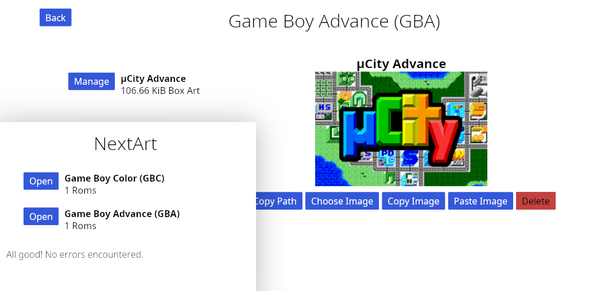

# NextArt



NextArt is a desktop application for managing box art images for your ROM collections. It provides an easy way to view, add, replace, and organize artwork for your game libraries.

[](https://crates.io/crates/nextart)
[](https://github.com/sysrqmagician/nextart/blob/main/LICENSE)
[](https://github.com/sysrqmagician/nextart/releases)


## Features

- **Box Art Management**: View, add, replace, copy, and delete box art for each ROM
- **Clipboard Integration**: Easily copy/paste box art images directly from the clipboard

## Installation

### Build using cargo
```bash
cargo install nextart
```


### Download pre-built binaries
Download the latest binary for your system [here](https://github.com/sysrqmagician/nextart/releases/latest)


## Directory Structure

NextArt expects your ROMs to be organized in the NextUI format:

```
Root Directory/
├── Collection1/
│   ├── game1.rom
│   ├── game2.rom
│   └── .media/
│       ├── game1.png
│       └── game2.png
├── Collection2/
│   ├── game3.rom
│   └── .media/
│       └── game3.png
```

## Contributing

Contributions are welcome! Please feel free to submit a Pull Request.

## License

This project is licensed under the GPL-v3 License - see the [LICENSE file](LICENSE) for details.
